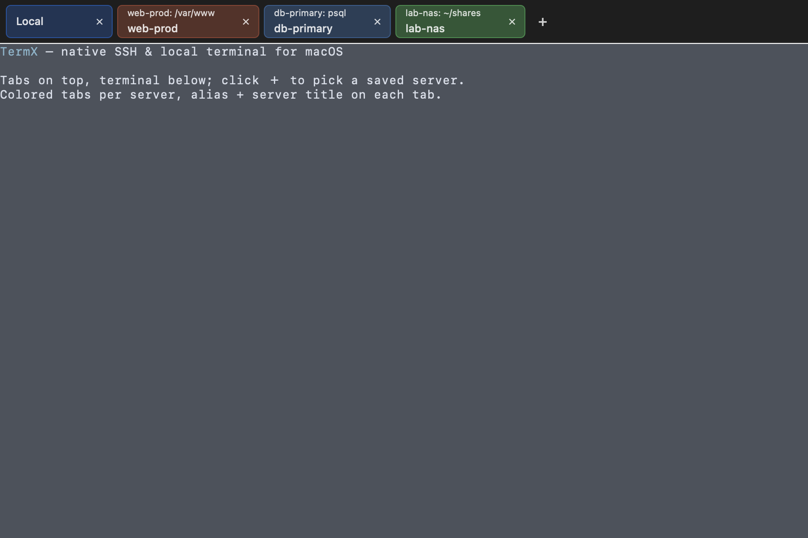
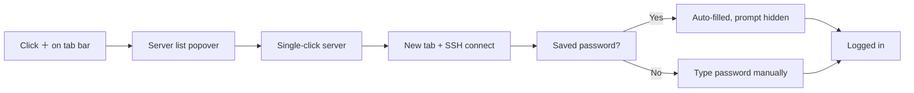
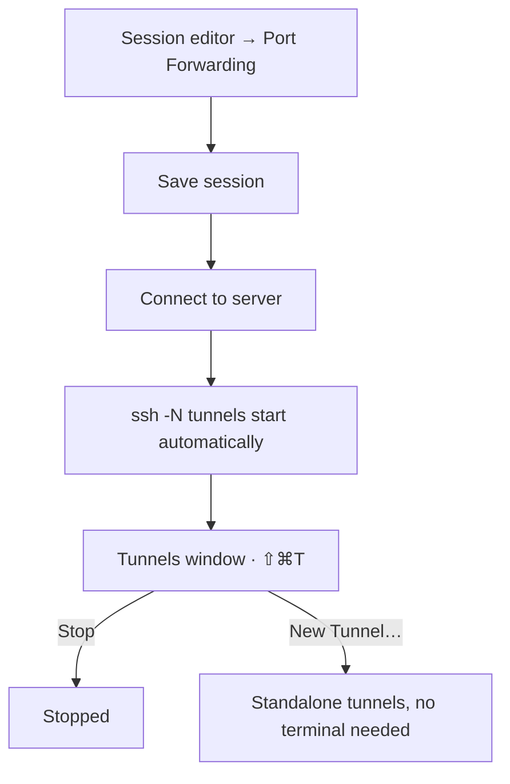
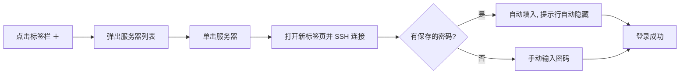
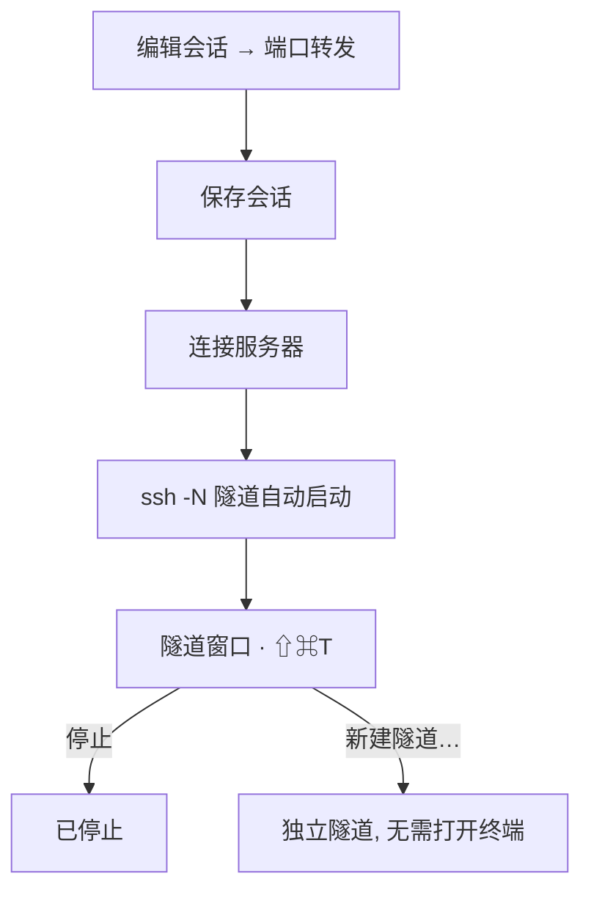

# TermX

**目录 / Contents**

- [English](#english)
  - [Features](#features) · [Quick Start](#quick-start) · [Usage](#usage) · [Shortcuts](#shortcuts)
- [中文](#中文)
  - [功能特性](#功能特性) · [快速开始](#快速开始) · [使用说明](#使用说明) · [快捷键](#快捷键)

## English

> A native SSH / local terminal app for macOS — a lightweight MobaXterm alternative. Built entirely with Swift + AppKit + SwiftTerm. No Electron, no X11 dependency.



*Main window: tab strip (alias + server title, per-server colors) and terminal area. The screenshot above shows fictional demo data.*

### 🗂 Project Structure

```text
TermX/
├── Package.swift              # SwiftPM manifest
├── Scripts/
│   ├── build_app.sh           # Build, bundle, sign the .app
│   └── make_icon.swift        # Optional programmatic app-icon renderer
├── Resources/
│   ├── Info.plist
│   └── AppIcon.icns
├── CHANGELOG.md             # Version history / update log
├── Sources/
│   ├── CPTY/                  # C bridge: forkpty / pty_spawn / winsize
│   ├── TermXCore/             # Testable core: models, SSH auth, storage, i18n
│   ├── TermX/                 # App: UI, terminals, tunnels, coordination
│   └── TermXTests/            # Unit tests (lightweight runner, `swift run TermXTests`)
└── docs/
    └── main-window.png        # README screenshot (fictional data)
```

### ✨ Features

- **Native macOS app**: Swift + AppKit; uses Metal GPU rendering when opaque for smooth, efficient output
- **Multiple tabs**: local shells and SSH sessions side by side; the same server can have many tabs
- **Tabs as windows**: drag a tab out into its own window (⇧⌘D), or move it back (⌥⌘D)
- **Server management**: a single **Server** menu — new SSH session, session manager, edit/delete current session
- **Auto-login**: passwords are stored locally (simple obfuscation) and filled automatically; the `user@host's password:` prompt is hidden from the terminal
- **Port forwarding**: per-session local / remote / dynamic SSH tunnels that start automatically on connect, plus a Tunnels window to monitor and stop them — or create standalone tunnels without opening a terminal
- **Per-server tab colors**: color-code tabs so servers are instantly recognizable
- **Themes**: Dracula / Solarized / One Dark / Gruvbox / Nord / Monokai and more (10 built-in schemes)
- **Background opacity**: 30%–100%, with real window transparency
- **Bilingual UI**: English by default, Simplified Chinese available — switch instantly from the app menu (Language / 语言)
- **Export terminal log**: save the full scrollback as a log file (⌘S)
- **Right-click copy**: right-click copies the current selection
- **High throughput**: bounded backpressure on output reads; `yes` or `find /` won't freeze the UI
- No X11: SSH uses the system OpenSSH (`/usr/bin/ssh`)

### 🚀 Quick Start

#### Requirements

- macOS 13+
- Xcode Command Line Tools (`xcode-select --install`)

#### Build

```bash
git clone <your-repository-url>
cd TermX
./Scripts/build_app.sh
open dist/TermX.app
```

`build_app.sh` performs: release build → bundle `.app` → embed SwiftTerm Metal shaders → ad-hoc signing.

#### Run manually

Double-click `dist/TermX.app`, or run:

```bash
open dist/TermX.app
```

### 📖 Usage

#### 1. Add a server

Use **Server → New SSH Session…** (⌘N) or **Server → Session Manager…** (⌘O):

| Field | Description |
| --- | --- |
| Alias (Display Name) | Shown on the tab and window title; leave empty to use `user@host` |
| Type | SSH or local session |
| Host / Port / Username | Server address, port (default 22), username |
| Authentication | Password or key file (private key path + picker) |
| Save password | Store the password in the local session file |
| Tab Color | Per-server tab color |
| Port Forwarding | Edit forwarding rules (see below) |

> Example: Alias=`web-prod`, Host=`your-server.com`, Username=`root`.

#### 2. Connect to a server

Click the **＋** button on the tab bar to open the saved-server list, then **single-click** to connect (each click opens a new tab, so the same server can have multiple tabs). You can also right-click a server for quick actions.

Connection flow:



#### 3. Port forwarding (tunnels)

1. In the session editor, click **Port Forwarding → Edit…**
2. Add rules: **Direction** (Local / Remote / Dynamic), **Port**, and for Local/Remote also **Target Host** and **Target Port**
3. Save the session and connect — tunnels start automatically
4. Open **Server → Tunnels…** (⇧⌘T) to watch status and stop tunnels; or click **New Tunnel…** there to create tunnels without opening a terminal



#### 4. Tab operations

- **Switch**: click a tab
- **Close**: ⌘W or the ✕ on the tab; closing the last tab also closes the main window
- **Detach**: drag a tab out, or ⇧⌘D
- **Dock back**: ⌥⌘D, or drag the detached window by its title bar and release it over the main window's tab strip to merge it back (the strip highlights as a drop target)
- **Colors**: the whole tab is tinted with the server color (edit session → Tab Color)
- **Two-line tabs**: line 1 is the alias, line 2 shows the server title in real time (OSC)

#### 5. Appearance

- **Themes**: View → Themes, applied to the active terminal
- **Background**: View → Terminal Background → Opacity (30%–100%); translucent mode falls back to Core Graphics
- **Font size**: View → Increase / Decrease / Reset Font Size (⌘+ / ⌘- / ⌘0)

#### 6. Language

App menu **TermX → Language / 语言**: switch between English and 简体中文 instantly; the choice is remembered.

#### 7. Export log

**File → Export Terminal Log…** (⌘S) saves the full scrollback of the current terminal as a UTF-8 log file.

### ⌨️ Shortcuts

| Action | Shortcut |
| --- | --- |
| New SSH session | ⌘N |
| New local terminal | ⌘T |
| Session manager | ⌘O |
| Export terminal log | ⌘S |
| Close tab | ⌘W |
| Detach tab to separate window | ⇧⌘D |
| Dock back to main window | ⌥⌘D |
| Tunnels window | ⇧⌘T |
| Increase / decrease font size | ⌘+ / ⌘- |
| Reset font size | ⌘0 |
| Copy / paste | ⌘C / ⌘V |
| Find | ⌘F |

### 💾 Data & Security

- Sessions: `~/Library/Application Support/TermX/sessions.json`
- Passwords: stored in the same file with basic obfuscation (not strong encryption). **Do not store sensitive passwords on untrusted machines**
- Window state & appearance: UserDefaults (`TermX.bgOpacity`, `TermX.language`, …)
- Older builds that stored passwords in Keychain are migrated to the local file on first launch, and the Keychain items are removed

### 🛠️ FAQ

**Does tmux crash?**
No — fixed. SwiftTerm's view callbacks must run on the main thread; TermX parses on the main thread with bounded backpressure, so tmux / vim / top all work.

**Dock icon not showing?**
The icon file is valid and readable by the system; if the Dock still shows a generic icon, log out and back in (or reboot) to flush the icon cache.

**Where is SFTP?**
SFTP file transfer is planned for the next release. Port forwarding is available now.

**Is the password stored in plain text?**
No — it is obfuscated, but that is basic protection only. Use your own Keychain/secure storage for stronger requirements.

### 🧱 Architecture

- **Terminal emulation**: SwiftTerm (VT100/xterm parsing, scrollback, selection, search)
- **Rendering**: Metal (opaque) / Core Graphics (translucent)
- **PTY**: custom C bridge (`forkpty` + bounded-backpressure reader thread)
- **SSH**: system OpenSSH with auto password injection and hidden prompt
- **Tunnels**: background `ssh -N` processes with the same auto-login handling
- **Persistence**: JSON session file (obfuscated passwords) + UserDefaults

### 📄 License

**No license — no rights reserved.** This is a vibe-coding project released for free use. Use, modify, and redistribute it for any purpose, without any restrictions.

### 🙏 Credits

- [SwiftTerm](https://github.com/migueldeicaza/SwiftTerm) — terminal emulation core
- Apple Swift / AppKit / Metal ecosystem
- Special thanks to **DeepSeek** — for doing most of the thinking — and to **Ash**, for footing the token bill. 😄

---

## 中文

> 一款面向 macOS 的原生 SSH / 本地终端（类似 MobaXterm 的轻量替代品），纯 Swift + AppKit + SwiftTerm 编写，无 Electron、无 X11 依赖。


*主界面：标签条（别名 + 服务器标题、按服务器着色）+ 终端区域。上图为虚构演示数据。*

### 🗂 项目结构

```text
TermX/
├── Package.swift              # SwiftPM 工程定义
├── Scripts/
│   ├── build_app.sh           # 编译、打包、签名 .app
│   └── make_icon.swift        # 可选：程序化生成应用图标
├── Resources/
│   ├── Info.plist
│   └── AppIcon.icns
├── Sources/
│   ├── CPTY/                  # C 桥接层：forkpty / pty_spawn / 窗口尺寸
│   ├── TermXCore/             # 可测试核心：模型、SSH 认证、存储、多语言
│   ├── TermX/                 # 应用：界面、终端、隧道、协调
│   └── TermXTests/            # 单元测试（轻量运行器，`swift run TermXTests`）
└── docs/
    └── main-window.png        # README 截图（虚构数据）
```

### ✨ 功能特性

- **原生 macOS 应用**：Swift + AppKit，100% 不透明时使用 Metal GPU 渲染，流畅且省电
- **多标签终端**：本地 shell 与 SSH 会话混排，同一服务器可开多个标签
- **标签即窗口**：标签可直接拖出成独立窗口（⇧⌘D），也可以移回主窗口（⌥⌘D）
- **服务器管理**：集中在一个「服务器」菜单——新建 SSH、会话管理器、编辑/删除当前会话
- **自动登录**：密码保存在本地（简单混淆），连接时自动填入；密码提示行（`user@host's password:`）自动隐藏
- **端口转发**：会话可配置本地/远程/动态 SSH 隧道，连接时自动启动；「隧道」窗口可查看状态、停止，或不开终端单独建隧道
- **标签着色**：每个服务器可配置专属标签颜色，一目了然
- **主题系统**：内置 Dracula / Solarized / One Dark / Gruvbox / Nord / Monokai 等 10 套配色
- **终端背景透明度**：30%–100% 可调，支持真实窗口透出
- **多语言**：默认英文，支持简体中文，菜单内一键切换（Language / 语言）
- **终端日志导出**：一键把完整滚动内容保存为日志文件（⌘S）
- **右键复制**：选中文本后右键自动复制到剪贴板
- **高吞吐**：输出读取带背压控制，解析不堆积，`yes`/`find /` 也不会卡住界面
- 不依赖 X11，SSH 走系统自带 OpenSSH（`/usr/bin/ssh`）

### 🚀 快速开始

#### 环境要求

- macOS 13+
- Xcode Command Line Tools（`xcode-select --install`）

#### 构建

```bash
git clone <你的仓库地址>
cd TermX
./Scripts/build_app.sh
open dist/TermX.app
```

`build_app.sh` 会完成：release 编译 → 组装 `.app` → 内置 SwiftTerm Metal 着色器 → ad-hoc 签名。

#### 手动运行

双击 `dist/TermX.app`，或在终端执行：

```bash
open dist/TermX.app
```

### 📖 使用说明

#### 1. 添加服务器

通过菜单 **Server → New SSH Session…**（⌘N）或 **Server → Session Manager…**（⌘O）打开编辑窗口：

| 字段 | 说明 |
| --- | --- |
| Alias (Display Name) | 显示名/别名，标签页与窗口标题固定显示它；留空自动使用 `user@host` |
| Type | SSH 或本地会话 |
| Host / Port / Username | 服务器地址、端口（默认 22）、用户名 |
| Authentication | 密码或密钥文件（私钥路径 + 选择器） |
| Save password | 勾选后密码保存在本地会话文件中 |
| Tab Color | 为这个服务器指定标签颜色 |
| Port Forwarding | 配置端口转发规则（见下文） |

> 示例：Alias=`web-prod`，Host=`your-server.com`，Username=`root`。

#### 2. 连接服务器

点击标签栏右上角的 **＋**，弹出已保存的服务器列表，**单击**即连接（每次都是新标签，同一服务器可多开）。也可以右键服务器使用快捷菜单。

连接流程：



#### 3. 端口转发（隧道）

1. 编辑会话 → 点 **Port Forwarding → Edit…**
2. 添加规则：**方向**（本地 / 远程 / 动态）、**端口**，本地/远程还要填**目标主机**和**目标端口**
3. 保存并连接——隧道自动启动
4. 菜单 **Server → Tunnels…**（⇧⌘T）打开「隧道」窗口查看状态、停止隧道；也可以点 **New Tunnel…** 不开终端单独建隧道



#### 4. 标签操作

- **切换**：单击标签
- **关闭**：⌘W 或标签上的 ✕；关闭最后一个标签时主窗口自动关闭
- **拖出为独立窗口**：按住标签拖出（或 ⇧⌘D）
- **移回主窗口**：⌥⌘D，或按住独立窗口标题栏拖到主窗口标签条上**松开**即合并（悬停时标签条会高亮提示）
- **颜色**：标签整块显示服务器颜色（编辑会话 → Tab Color）
- **两行标题**：第一行是别名，第二行实时显示服务器发来的标题（OSC）

#### 5. 外观

- **主题**：View → Themes，作用于当前活动终端
- **终端背景**：View → Terminal Background → Opacity，30%–100% 五档；半透明时自动降级为 Core Graphics 渲染
- **字号**：View → Increase / Decrease / Reset Font Size（⌘+ / ⌘- / ⌘0）

#### 6. 多语言

应用菜单 **TermX → Language / 语言**，切换 English / 简体中文，即时生效并记住选择。

#### 7. 导出日志

**File → Export Terminal Log…**（⌘S），把当前终端的完整滚动内容（含历史）保存为 UTF-8 日志文件。

### ⌨️ 快捷键

| 功能 | 快捷键 |
| --- | --- |
| 新建 SSH 会话 | ⌘N |
| 新建本地终端 | ⌘T |
| 会话管理器 | ⌘O |
| 导出终端日志 | ⌘S |
| 关闭标签页 | ⌘W |
| 标签页移到独立窗口 | ⇧⌘D |
| 独立窗口移回主窗口 | ⌥⌘D |
| 隧道窗口 | ⇧⌘T |
| 增大 / 减小字号 | ⌘+ / ⌘- |
| 恢复默认字号 | ⌘0 |
| 复制 / 粘贴 | ⌘C / ⌘V |
| 查找 | ⌘F |

### 💾 数据与安全

- 会话列表：`~/Library/Application Support/TermX/sessions.json`
- 密码：与会话一同保存在该文件内，做了基础混淆（非强加密）。**请勿在不可信环境存放敏感密码**
- 窗口状态与外观偏好：UserDefaults（`TermX.bgOpacity`、`TermX.language` 等）
- 旧版本（使用钥匙串存密码）会在首次启动时自动迁移到本地文件，并删除钥匙串条目

### 🛠️ 常见问题

**运行 tmux 崩溃？**
已修复：SwiftTerm 的视图回调必须在主线程执行，TermX 使用主线程解析 + 有界背压，tmux / vim / top 等应用均可正常使用。

**Dock 图标不显示？**
图标文件有效且系统可正常读取；若 Dock 仍显示通用图标，注销登录或重启一次即可（图标缓存问题）。

**为什么没有 SFTP？**
SFTP 文件传输计划在下个版本提供；端口转发现在已经支持。

**密码是明文吗？**
不是明文，但只是基础混淆；如需强加密可自行改用钥匙串或系统安全服务。

### 🧱 技术架构

- **终端模拟**：SwiftTerm（VT100/xterm 解析、滚动缓冲、选择与搜索）
- **渲染**：Metal（不透明时）/ Core Graphics（半透明时）
- **PTY**：自研 C 桥接层（forkpty + 有界背压读取线程）
- **SSH**：系统 OpenSSH，自动密码注入 + 提示行隐藏
- **隧道**：后台 `ssh -N` 进程，复用同一套自动登录处理
- **持久化**：JSON 会话文件（密码混淆）+ UserDefaults

### 📄 许可证

**无许可证，无任何权利保留。** 本项目是纯 vibe coding 产物，完全开放：任何人都可以随意使用、修改、分发，无任何限制。

### 🙏 致谢

- [SwiftTerm](https://github.com/migueldeicaza/SwiftTerm) —— 终端模拟核心
- Apple Swift / AppKit / Metal 生态
- 特别致谢 **DeepSeek**——贡献了绝大部分思考；以及 **Ash**——贡献了绝大部分 token 账单。😂
